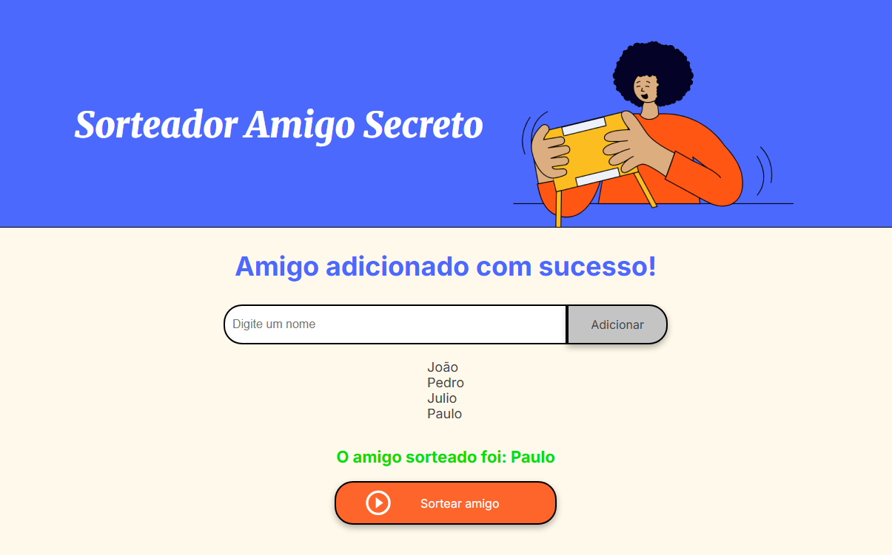

# Sorteador Amigo Secreto  
Um pequeno projeto em JavaScript para realizar o sorteio de um amigo secreto!  

Este projeto foi desenvolvido como parte do **Programa ONE - Oracle Next Education**, em parceria com a **Alura**.  
Ele permite ao usuário adicionar nomes a uma lista de amigos e, em seguida, sortear um deles aleatoriamente.  

O objetivo principal é praticar conceitos de **arrays**, **funções** e manipulação do **DOM** em JavaScript.  

## Funcionalidades
- Adicionar nomes a uma lista de amigos.  
- Verificação para evitar **nomes inválidos** (apenas letras e espaços).  
- Prevenção de **nomes repetidos**.  
- Exibição dinâmica da lista de amigos adicionados.  
- Sorteio de um amigo de forma **aleatória**.  
- Exibição do resultado diretamente na página.  

## Regras do sorteio
- É necessário cadastrar **no mínimo 3 nomes** para realizar o sorteio.  
- O sistema verifica se os nomes adicionados são **válidos** (apenas letras e espaços).  
- O sistema também impede a inclusão de **nomes repetidos**.  

## Tecnologias utilizadas
- **HTML** (estrutura da página)  
- **CSS** (estilização da página)  
- **JavaScript** (lógica principal)  

## Como executar
1. Clone este repositório:
   ```bash
   git clone https://github.com/seu-usuario/seu-repositorio.git
   ```
2. Abra o arquivo `index.html` no navegador de sua preferência.

## Tela inicial
